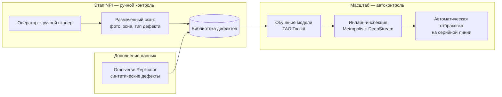
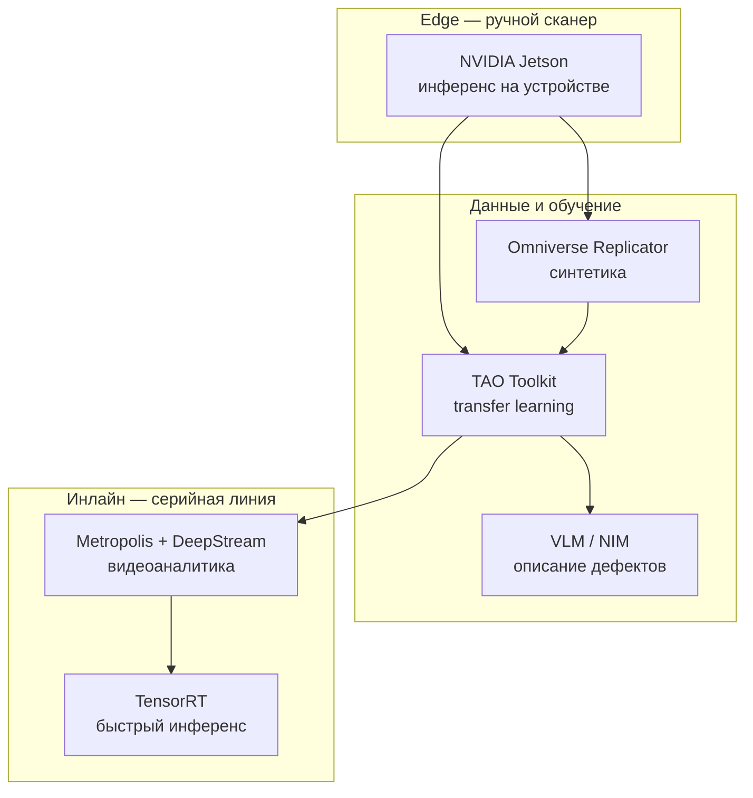
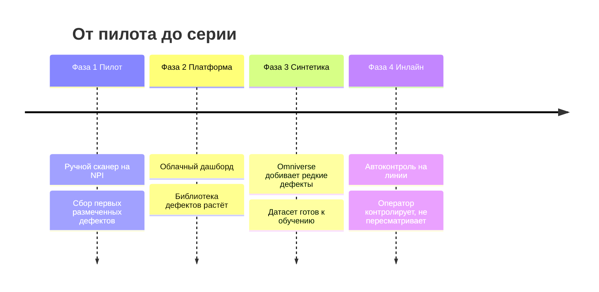

# RoboQC — архитектура и путь NPI → масштаб

## Идея в одной диаграмме: ручной контроль кормит автоматизацию

Ключ: одна и та же **библиотека дефектов** наполняется вручную на NPI и
синтетикой, а затем используется для обучения автоматического контроля. Ручной
труд на раннем этапе — это инвестиция в автоматизацию на масштабе.

## Стек компьютерного зрения NVIDIA

## Путь клиента по фазам

## Соответствие этапов и технологий

| Этап RoboQC | Технология NVIDIA | Что даёт |
|---|---|---|
| Ручной сканер на NPI | Jetson | Подсветка зон и теггинг дефектов в руке оператора |
| Дефицит данных на NPI | Omniverse Replicator | Синтетические редкие дефекты — закрытие нехватки |
| Накопление и обучение | TAO Toolkit | Модель на реальных + синтетических дефектах |
| Понимание дефектов | VLM / NIM | Классификация без полной ручной разметки |
| Автоконтроль на объёме | Metropolis + DeepStream | Инлайн-инспекция потока деталей |
| Скорость инференса | TensorRT | Контроль в темпе конвейера |
